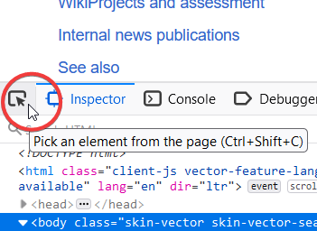
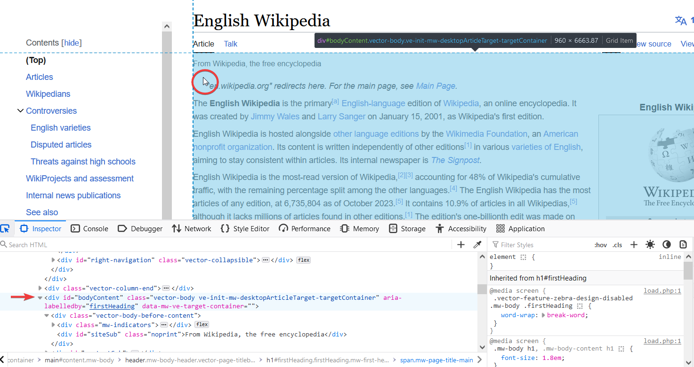

# HTML fetcher

This script transforms html files to text files with metadata

Created in Python 3.9.13

To run execute:

`py main.py --cls <cls>  --in <in>  --out <out> --ovw <True|False>`

or

`py main.py --cio <all>  --ovw <True|False>`

where

```
--cls <class file name in extr folder without extention> 

--in <name of input folder in ./input> 

--out <name of output folder in ./output>

--ovw <optional flag, if true deletes the result output folder if exists, default - False>

--cio <optional, acts as alias for --cls, --in and --out combined, 
        --cls, --in and --out value are prioritised over the --cio value>
--thr <number of threads to use>
```

Practicle examples:

`py main.py --cls AniaGotuje_cls --in AniaGotuje_in --out AniaGotuje_out`

`py main.py --cio AniaGotuje --thr 5`

`py main.py --cio AniaGotuje --in AniaGotuje_2`

`py main.py --cio AniaGotuje --ovw True`

To use the universal extractor, run:

`py main.py --cio AniaGotuje --cls ExpressArticle`

To parse your website create a new class file in extr and then provide its name as `--cls` argument.

The output folder contains txt files of pages content and pickle file containing a dictionary `(name of file without extention, dictionary with dictionary with metadata)`. 

Files for which the extraction failed are stored in `failedlinks.txt`, generated during runtime of the script.

Additional info:
`test_grounds.ipynb` is a file where you can experiment with extracting information from your target html in order to create your custom extractor class. Additionally a template class is included and located in `extr/Template.py`

Most conveniet way to explore the page is using the inspector in browser, which iscalled by `F12`. You can look for html elements either by browsing the html code or by using the select tool to directly pick the element on the page itself. 

F.e. to do so in firefox click the button at the top left of the inspector and then left-click the desired object, html inspector will go the the exact place where this element is declared.



